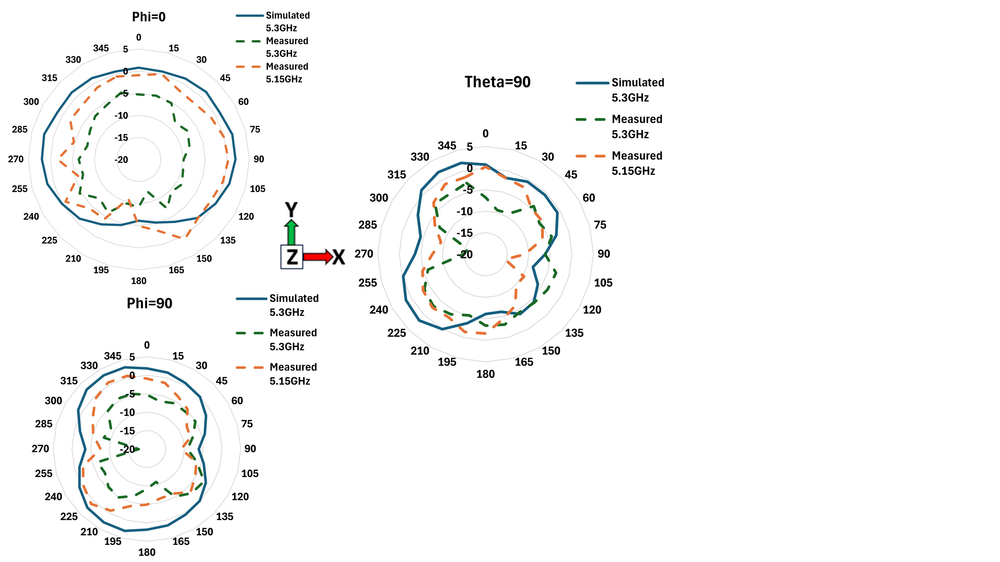
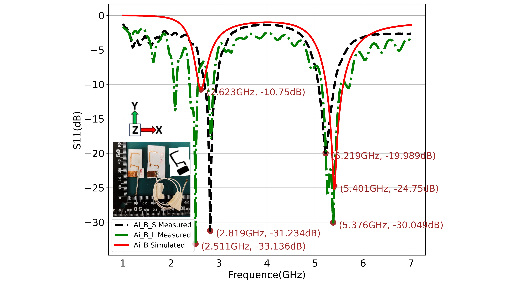

# Opening move
Antenna design is crucial in wireless communication, particularly for multi-band applications. Traditional methods for antenna design and optimization face significant challenges, especially when it comes to designing complex structures like dual-band antennas. In this context, we will explore the application of Machine Learning (ML) and Generative Adversarial Networks (GANs) in antenna design and compare their advantages and limitations.
Machine Learning in Antenna Design
Traditional antenna design relies heavily on the expertise of engineers and extensive computational simulations. Machine learning algorithms, such as Random Forest, Support Vector Machines (SVM), and Neural Networks, can greatly enhance this process. These models learn from large datasets of antenna structures and their corresponding performance metrics to predict and optimize new antenna designs.
Advantages:
1. Automated Optimization: ML models can quickly learn and predict the performance of different antenna designs, automating the optimization process and reducing design time.
2. Rapid Prediction: Once trained, ML models can predict antenna performance much faster than traditional electromagnetic simulation tools.
Challenges:
1. Single Objective Focus: Traditional ML methods usually optimize for a single frequency band or performance metric. Designing multi-band antennas (like dual-band antennas) requires multi-objective optimization, which can be challenging for a single model.
2. Data Dependence: The performance of ML models is highly dependent on the quality and diversity of the training data. If the training data is insufficient or lacks diversity, the model may not generalize well to new designs.
Generative Adversarial Networks (GANs) in Antenna Design
GANs consist of a generator and a discriminator, which work against each other to improve the model's performance. In antenna design, GANs can be used to generate novel and efficient antenna structures, particularly excelling in multi-band antenna design.
Advantages:
1. Innovative Design: The generator in a GAN can create innovative antenna structures that might be difficult to conceive using traditional design methods. This is particularly useful for designing dual-band or multi-band antennas, as GANs can automatically explore complex interactions between frequency bands.
2. Multi-Band Optimization: GANs can consider multiple performance metrics across different frequency bands simultaneously, often generating antenna structures that perform well across several bands without relying on single-band optimization.
3. Design Diversity: GANs can generate a diverse range of antenna designs with different structures and performance characteristics, giving designers more options to meet specific application needs.
Challenges:
1. Training Complexity: Training GANs is complex, particularly due to the adversarial process between the generator and discriminator, which can lead to instability and difficulty in model convergence.
2. High-Quality Data Requirement: While GANs have the ability to generate new structures, their performance is still highly dependent on the quality of the training data. If the training dataset lacks richness or diversity, the GAN may struggle to produce high-quality antenna designs.

Comparison and Conclusion
Basic machine learning methods are primarily used to speed up the design and optimization process for single-band antennas, but they often fall short when dealing with the complexities of multi-band antenna design. On the other hand, GANs, as a deep learning model, excel in generating innovative and diverse antenna structures, particularly for multi-band designs.
In summary, for simple antenna design, machine learning can significantly accelerate the process. However, when it comes to multi-band antenna design, the innovative and multi-objective optimization capabilities of GANs make them a more promising tool.
Here are two of the five sample sources used to train the single-frequency antenna.

## 4180 ANTENNAS DATASET

  
  

Using data augmentation methods, 4180 antenna samples were generated, the augmentation process heavily relied on geometric transformations, which included the following key aspects:

##	Rotation: 
The antenna designs were rotated at various angles, simulating potential orientation changes during installation or usage. This transformation generates different antenna responses based on the direction of the antenna.

##	Translation: 
The antennas were translated to different positions within the design space. This simulates variations in the installation location, helping to generate a more diverse set of data samples.

##	Position Shifts: 
Beyond simple translation, precise adjustments were made to the antennas' positions within the design plane or space. These shifts simulate slight positional deviations that might occur during installation, producing more realistic samples.

##	Slight Distortion: 
Minor distortions were applied to the antenna structures. These distortions simulate small deformations that might occur due to material properties or manufacturing processes. This technique helps generate more robust samples, preparing the model to handle slight structural variations in real-world applications.

By applying these geometric transformation techniques, the data augmentation process produced a more diverse set of antenna samples. These samples not only cover a wide range of possible variations of the original designs but also introduce additional design variations, better supporting subsequent model training and performance evaluation. as shown in Figure 10. These images were mapped to the actual physical antenna sizes using 512x512 (RGB) PNG format. The images were converted to an 1:1 pixel ratio for AI subsequent learning. The Hough transform was utilized to enhance the correlation between antenna dimensions and frequency for feature extraction. These feature points act as labels in antenna design.

## Analysis of simulated and measured AI Antenna's S11 and Radiation Pattern Performance

  
  

## Fig.1 S11 measurement and Ai Gen.antennas.

  

Fig.2 The comparison graph of the antenna's S11 in Paper A under three conditions: original 300mm length (Ai_A_L Measured), shortened length (Ai_A_S Measured) and simulated without cable (Ai_A Simulated). The comparison reveals that the S11 measurement of the antenna after cable length shortening (25mm) does not exhibit the oscillation phenomenon observed in the original paper (with cable length of 300mm)

 
Figure 3: The polar plots illustrate the radiation patterns of the antenna at two different frequencies (2.97 GHz and 3.32 GHz) across three different planes (Phi = 0°, Phi = 90°, and Theta = 90°). The plots compare the simulated patterns with the measured shortened length ones for the 2.97 GHz frequency, as well as the measured patterns for 3.32 GHz, which is the frequency with the best measured S11 (return loss). The measured radiation efficiency at 3.32 GHz is -1.534 dB (70.22 %). 

 
Fig.4 The polar plots illustrate the radiation patterns of the antenna at two different frequencies (5.3 GHz and 5.15 GHz) across three different planes (Phi = 0°, Phi = 90°, and Theta = 90°). The plots compare the simulated patterns with the measured shortened length ones for the 5.3 GHz frequency, as well as the measured patterns for 5.15 GHz, which is the frequency with the best measured S11 (return loss). The measured radiation efficiency at 5.15 GHz is -2.759 dB (52.97 %)

  

 
Fig.5 The comparison graph of the antenna's S11 in Paper A under three conditions: original 300mm length (Ai_B_L Measured), shortened length (Ai_B_S Measured) and simulated without cable (Ai_B Simulated). The comparison reveals that S11 measurement of the antenna after cable length shortening (25mm) does not exhibit the oscillation phenomenon observed in the original paper (with cable length of 300mm )

  
  

 
Fig.6 The polar plots illustrate the radiation patterns of the antenna at two different frequencies (2.63 GHz and 2.81 GHz) across three different planes (Phi = 0°, Phi = 90°, and Theta = 90°). The plots compare the simulated patterns with the measured shortened length ones for the 2.63 GHz frequency, as well as the measured patterns for 2.81 GHz, which is the frequency with the best measured S11 (return loss). The measured radiation efficiency at 2.81 GHz is -0.643 dB (86.24 %).

 
  

Fig.7 The polar plots illustrate the radiation patterns of the antenna at two different frequencies (5.4 GHz and 5.2 GHz) across three different planes (Phi = 0°, Phi = 90°, and Theta = 90°). The plots compare the simulated patterns with the measured shortened length ones for the 5.4 GHz frequency, as well as the measured patterns for 5.2 GHz, which is the frequency with the best measured S11 (return loss). The measured radiation efficiency at 5.2 GHz is -1.405 dB (72.35 %).
